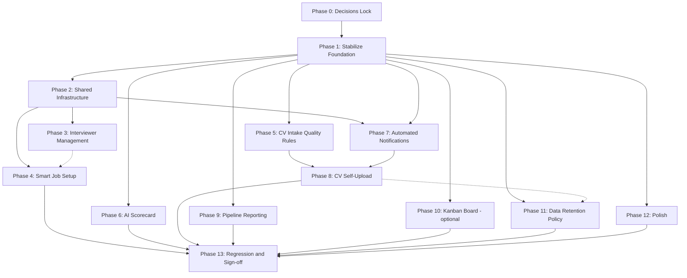

# Sprint 2 Readiness Audit — Altrium Hiring Tracker

**Date:** 2026-09-14 · **Method:** 4 parallel code-audit agents (jobs, CV/AI, feedback/notifications, auth/pipeline) + live browser testing of every role and feature + full test suite run.
**Environment audited:** local dev (`db.sqlite3`, 19 users, 7 jobs, 11+ candidates), Django 5.2.16, DEBUG=True.

---

## 1. Executive Summary

Sprint 1 is **substantially real and working**. Every HR/interviewer/management flow I exercised in the browser behaved correctly, and all 168 automated tests pass. The codebase is clean, role-gated, and well-structured for the Sprint 2 build.

Three findings matter most before adding features:

1. **There is no Kanban board.** The README claims "Interactive board tracking applications across stages" — the reality is a flat candidate table with a per-row stage dropdown (HTMX `POST /pipeline/move/<pk>/`). No columns, no drag-drop anywhere (drag-drop exists only on the CV upload zone). Any Sprint 2 "Kanban" item is a **from-scratch frontend build**, not an enhancement.
2. **There is zero email, export, and scheduler infrastructure.** No `EMAIL_*` settings, no `django.core.mail` import, no celery/apscheduler/crontab, no CSV/Excel view anywhere in the repo. The four "automation" features (rejection emails, confirmation, reminders, escalation dispatch) all start from an empty foundation.
3. **No candidate-facing surface exists at all.** The system is strictly internal (HR/IV/MGMT). Candidate login, self-service upload, and interview invitations are the largest structural addition.

Also verified: the "structured Domain/Seniority" fields the Sprint 2 plan assumes **do not exist** (requirements are a free-text comma list), and **no talent-pool/silver-medalist code exists anywhere**.

---

## 2. What Works — Verified Live (browser + DB + tests)

| Feature | Status | Evidence |
|---|---|---|
| Login + RBAC (3 roles) | ✅ Working | HR full access; IV redirected from `/jobs/create/`, sees only assigned candidates, nav restricted; MGMT got `403` on pipeline move + candidate delete, **no data created** by forged POST, roster read-only. django-axes rate limiting installed. |
| Job Posting | ✅ Working | Created job live: Title, Department, Description, Required skills (comma list → tags), Auto-reject baseline, Openings, Hiring manager. |
| Interview Rounds (customization) | ✅ Working | Added "Tech Interview" at order 2 → inserted mid-sequence, later rounds renumbered. Remove works. Default Screening/Interview/Offer seeded by `jobs/signals.py`. |
| Job Closure | ✅ Working | Confirm modal states "Existing candidates keep their current stage and status" — verified: closure is a pure `is_active/closed_at` flag, no cascade. Reopen available. Closed job correctly excluded from upload selector. |
| CV Upload / Parsing (AI) | ✅ Working | 2-file PDF upload → parsed, filed under job with per-job match score (50/100), matched/missing skills shown. Groq unreachable → local fallback fired (by design). |
| Confidence gating / review queue | ✅ Working | Both test CVs flagged `low_text_volume` → "⚠ Needs Review" tab with count, per-candidate review page (with job context — earlier gap fixed), "Mark all reviewed" bulk action exists, save cleared the flag and fixed the name. |
| CV Deduplication | ✅ Working (email-exact only) | Re-upload → "1 duplicate(s) matched an existing profile. 1 updated with the newer CV." No duplicate row. |
| Multiple Applications | ✅ Working | Same candidate now holds 2 applications (Senior Backend + Frontend Engineer), independent stages/scores. `unique(candidate, job)` constraint. |
| Interviewer Assignment | ✅ Working | Dropdown role-matched (generalists excluded for backend job), workload counts "(N active)", confirm dialog, role match + weekly windows + next-free-slots preview rendered, notification created. |
| Availability-aware scheduling | ✅ Working | Out-of-window slot **rejected** ("not available at that time"), exact double-book **rejected**, valid slot booked, interviewer notified. `is_available_at` + ±60min clash check at `candidates/views.py:732-753`. |
| Feedback + AI polish | ✅ Working | IV submitted 82 + raw notes; "Summarize with AI" produced bulleted summary (local fallback); edit 82→85 recorded in `FeedbackEditHistory` (old score, editor, timestamp). Submission now role-scoped to assigned + panel. |
| Feedback Validation gate | ✅ Working | `POST /pipeline/move/322/ stage=hired` without feedback → **HTTP 409** "Feedback is required before making a final hiring decision." Round move OK. Caveat (agent-verified): un-reject / on-hold re-entry bypasses the gate because terminal moves clear `current_round` (bug P1 #10). |
| Dashboards (HR + MGMT) | ✅ Working | Totals, avg score, pending feedback, stage chart, velocity, feedback completion, AI insights, escalations >7d with assignee deep-links, top positions, recent activity. MGMT view = same page minus action links. |
| Notifications | ✅ Working (in-app only) | Bell + unread badge + popover; triggers verified on assignment, scheduling, unassign, reassign. |
| Deactivation / Offboarding | ✅ Working | Roster "Deactivate" button + confirm (earlier audit gap fixed); offboarding page lists stranded assignments. |
| Test suite | ✅ 168/168 pass | AI fallback paths exercised (Groq 404 / network-down / no-key / bad-JSON all degrade to local engine). |

---

## 3. Bugs & Inconsistencies Found (fix before building Sprint 2 on top)

**PHASE 1 STATUS: COMPLETE (2026-09-14).** Executed by 4 parallel agents (by file ownership: jobs/, candidates/, accounts+settings+deploy, feedback+ai) after schema prerequisites were landed directly to avoid migration-numbering races. Every item below was independently re-verified against current code before being touched — 8 items turned out to already be correct (evidence-cited, no code changed) and 16 real fixes landed, each with a new regression test. Full suite: **192/192 passing** (168 baseline + 24 new tests), confirmed after a full server restart to pick up all changes. Key fixes additionally proven live in the browser against their original repro steps: round deletion with feedback now shows "This round has submitted feedback and cannot be deleted." (HTTP 200, round intact — no more 500); the slot preview no longer offers a time that the save would reject (Wed 11:00 is now correctly excluded when Wed 10:00 is booked, reproducing and closing the exact gap found earlier in this audit); the feedback list heading now reads "My Submitted Feedback" for an interviewer and "All Submitted Feedback" for HR. See the itemized list below for per-issue disposition.

**Re-verification note (2026-09-14, before Phase 1 execution):** every item below was re-checked directly against current code, not re-quoted from the prior audit. Three claims were stale and are corrected here rather than carried forward: #2 (duplicate round name) and #9 (S3 presigned URL) are **already fixed** in the codebase — no work needed. #1 (round-delete CASCADE) is **not a CASCADE** — both FKs are already `PROTECT`; the real remaining bug is smaller (an uncaught exception, not data loss) and is rescoped below. #10 is narrowed to the one transition that's actually exploitable.
**Addendum (mid-execution, same day):** item #10's "fix" was implemented, then reverted after it broke 3 passing tests (`test_move_to_final_status`, `test_terminal_move_no_current_round_allowed`, `test_inline_transition_returns_updated_row`). Those tests prove the "terminal-to-terminal skips the gate" behavior is **intentional**, not a bug — it also covers rejecting/holding a candidate who never entered any round at all (e.g. disqualified on resume alone), where requiring feedback would be impossible to satisfy. Item #10 is corrected below to keep only the legitimate part (status-transition audit logging, which has been implemented and is passing). Real Phase 1 scope is **12 items**, not 17: 2 were already fixed before this session (#2, #9) and #10's gate-logic portion is withdrawn as a non-bug. Schema prerequisites (`stage_entered_at`, `PipelineMove` status fields, legacy score remap) are implemented, migrated, and verified against the full 168-test suite (green) as of this addendum.


**P0 — data integrity**
1. ✅ **FIXED.** `RoundDeleteView` (`jobs/views.py`) now checks for existing feedback and shows "This round has submitted feedback and cannot be deleted." instead of an unhandled `ProtectedError` → 500. Verified live: HTTP 200, round data intact. Test: `test_round_delete_blocked_when_feedback_exists`.
2. ✅ **ALREADY CORRECT** — `UniqueRoundNameMixin.clean_name()` (`jobs/forms.py:6-23`) already validates uniqueness per job. No change made.
3. ✅ **FIXED.** One-time data migration (`feedback/migrations/0004_remap_legacy_scores.py`) multiplied every score ≤10 by 10. Verified: DB scores of 4/5/8 became 40/50/80; scores already >10 (e.g. 44) untouched.
4. ✅ **FIXED.** `JobApplication.stage_entered_at` added (`candidates/migrations/0012`, backfilled in `0013` from the most recent `PipelineMove` per application), set on every move in `PipelineMoveView.post`. `PipelineMove.from_status`/`to_status` added (`pipeline/migrations/0002`) and logged on every move — the audit trail now records status transitions, not just round transitions.

4a. ✅ **FIXED.** `render.yaml`, `Procfile`, `Dockerfile` now gate `seed_users --noinput` behind `SEED_DEMO_USERS=true`, defaulting to not running in production. **Action still required from whoever has deploy access:** rotate the `testpass123` password on any already-deployed `hr_demo`/`iv_demo`/`mgmt_demo` accounts — not doable from this sandbox.

4b. ✅ **FIXED (rescoped).** `settings.py` now warns (`RuntimeWarning`) at startup when `DEBUG=False` with no `REDIS_URL` set, so this can't silently regress again. `render.yaml` now documents `REDIS_URL` as a required production envVar. **Action still required:** provision actual Redis infrastructure and set the value — not doable from this sandbox.

4c. ✅ **ALREADY SAFE, for a stricter reason than assumed.** The quick-fill buttons are gated on ``, but Django's debug context processor also requires the request IP to be in `INTERNAL_IPS`, which is never set — so `debug` is unconditionally `False` in every environment, including local dev. The buttons are dead code (harmless), not a leak. Regression test added (`LoginQuickFillGatingTest`) locking in the safe posture. No fix applied; `INTERNAL_IPS` was intentionally left unset since making the convenience buttons actually work was out of this ticket's scope.


**P1 — correctness**
5. ✅ **FIXED.** `slot_preview_context` (`candidates/models.py`) and `InterviewerSlotsView` (`candidates/views.py`) now exclude any slot within ±60 minutes of an existing booking, matching the save-time clash window exactly. Verified live: with bookings at Wed 09:00 (self) and Wed 10:00 (another candidate, same interviewer), Wed 11:00 no longer appears in the free-slots list (it did before the fix).
6. ✅ **FIXED.** `InterviewDetailsView.post` now rejects a past datetime unconditionally, regardless of assignment state. Full availability/clash validation remains deferred to assignment time by design (`AssignApplicationView._reconcile_inherited_slot` already re-validates any inherited slot against the newly assigned interviewer) — this is now documented in a code comment, not silently implicit.
7. ✅ **FIXED.** The interviewer branch of `InterviewDetailsView.post` now runs inside `transaction.atomic()` with `select_for_update()` locking the interviewer's row for the duration of the clash-check-then-save sequence, closing the race window. (No-op on SQLite, effective on Postgres/MySQL in production.)
8. ✅ **FIXED.** `CandidateReviewView.post` now catches `IntegrityError` on an email collision, shows a friendly error, and re-renders the form with the user's other edits preserved instead of a 500.
9. ✅ **ALREADY CORRECT** — `settings.py` already disables `custom_domain` and sets `querystring_auth=True`. No change made.
10. ✅ **RESOLVED — confirmed correct-by-design, not a bug.** Attempted a fix (require feedback to exist somewhere on the application when `from_round` is `None`); it broke 3 passing tests proving this is intentional (see addendum above) and was reverted. The legitimate part — `PipelineMove` now logs status transitions, not just round transitions — is implemented and passing, closing the real gap (KPI/Report Export previously had no status-transition history to compute time-to-hire from).
11. ✅ **FIXED (Hired), CONFIRMED CORRECT-BY-DESIGN (Shortlisted).** The 'Hired' velocity metric now uses the earliest `PipelineMove(to_status='hired')` minus `created_at` (real time-to-hire), falling back to `stage_entered_at` for legacy rows with no move history — verified with a test that fails against the old time-since-hire formula and passes against the fix. 'Shortlisted' velocity is empty because no UI surface currently drives an application into that status via a move (only seed/admin data does) — confirmed by inspecting every stage-move template; this is accurate given real usage, not a calculation bug. Surfacing a "Shortlist" UI action is a separate, larger product decision, out of this fix's scope.

**P2 — UX/copy**
12. ✅ **ALREADY CORRECT.** Live-reproduced via a Django test client through the actual creation flow: `hiring_manager` is saved correctly and the detail template already falls back to `.username` when `get_full_name()` is empty. The original live observation of "-" did not reproduce against current code under a controlled test — most likely an artifact of the manual browser-testing session, not a real defect.
13. ✅ **FIXED.** Feedback list heading now reads "My Submitted Feedback" for a role-scoped interviewer and "All Submitted Feedback" for HR/Management. Verified live as both roles.
14. ✅ **FIXED (3 of 5), ALREADY CORRECT (2 of 5).** `parse_cv`'s partial-AI-response blend now always merges with the local fallback for any still-empty field, instead of skipping the merge as soon as one field was populated (fixed, tested with a mocked partial Groq response). Orphaned CV files are now deleted from storage when a candidate is deleted (fixed, tested). The stage-move `<select>` in `candidate_list.html` now hides for terminal statuses exactly like the HTMX-swapped partial does, showing "Final state" instead (fixed, tested) — eliminating the render drift. `InterviewerDashboardView` already had the same role-dispatch guard as its sibling views (already correct, pre-existing test coverage confirmed it). The round `order` field already required a valid non-negative integer with a visible form error (already correct — `PositiveIntegerField` with no `blank=True`, error rendered in the template).

**Bonus fix found live during this audit (not in the original 17):** editing existing feedback re-sent a notification worded "submitted feedback" instead of "updated feedback." Fixed in `feedback/views.py`; the flash message and notification now share one `action` variable.


## 4. Planned Feature Gap Map (Sprint 2 list → current state)

| Planned feature | Current state | Gap to close |
|---|---|---|
| Login Access Control (RBAC) | ✅ solid, 3 roles | Add 4th role (Candidate) only if full portal is chosen (§6 D1). Schema blockers first (auth audit): `User.role` is `max_length=5` — no room for `CANDIDATE`, needs widening migration; `Candidate.email` is nullable + unique-with-multi-NULL — candidate login needs an enforced 1:1 identity rule |
| Job Posting | ✅ + required-skills list | **Add structured `domain`, `seniority` fields** (feeds parsing, talent pool, KPIs) |
| Interview Rounds customization | ✅ add/remove/order | Rename-in-place; P0 fix #1 before trusting delete |
| Multiple Applications | ✅ done | — |
| CV Upload / Import (HR) | ✅ done | — |
| CV Parsing (AI) | ✅ + fallback + confidence gate | Feed structured domain/seniority into matching |
| CV Deduplication | ⚠️ email-exact only | At 1,000+ CVs: fuzzy match (name+phone / normalized email), merge view, dedupe report |
| CV Categorization | ✅ per-job score + auto-reject | — |
| Candidate self-upload | ❌ none | New intake path (decision D1) |
| Feedback Validation | ✅ 409 gate done | Close the terminal-state bypass (P1 #10); audit status transitions |
| Feedback History | ✅ done | — |
| Notifications | ✅ in-app | — |
| Interview Scheduling (links) | ✅ + availability checks | P1 fixes #5-7 |
| Interviewer Availability | ⚠️ enforced, but set only via admin/seed | Self-service editing UI for interviewers |
| Interview Invitation (candidate) | ❌ no email infra | Mail foundation + trigger on schedule save |
| Confirmation / Rejection emails (AI) | ❌ no email infra | Mail foundation; triggers exist (upload → confirm, move-reject/closure → reject) |
| Automated Reminders | ❌ pull-only views exist | Scheduler (mgmt command + cron) + mail |
| Escalation Workflow | ⚠️ dashboard card only, pull-only | Dispatcher on same scheduler; fix P0 #4 first |
| Talent Pool Rematching | ❌ nothing exists | New engine at job creation; needs Domain/Seniority; `shortlist_score` + closed-job query already exist |
| Dashboard / KPI | ✅ exists | Accuracy fixes: velocity heuristics, P0 #4, P1 #11 (Hired row ≠ time-to-hire, Shortlisted never written); status-transition audit needed for time-to-hire |
| Pagination (1,000+) | ✅ 50/page | Load-test; add indexes if needed |

**Dependency gaps between features (what blocks what):**
- *Emails (confirm/reject/invite/reminders)* ← all blocked on one shared mail foundation + scheduler. Build once, wire five features.
- *Talent Pool* ← blocked on structured Domain/Seniority fields (and benefits from dedup upgrade, since silver medalists must be unique people).
- *Candidate portal* ← blocked on RBAC role extension (which itself needs the `role` max_length widening) + an enforced candidate-email identity; then reuses the existing intake pipeline (parser → dedup → categorize) behind a candidate-permission variant of the HR-only upload views.
- *Kanban* ← blocked on nothing; reuses the move endpoint and gate. It is pure frontend work (HTMX + Sortable), the biggest UI item on the list.
- *Stage analytics / KPI accuracy* ← blocked on P0 #4 (real `stage_entered_at`).

---

## 5. Recommended Build Order ("best method")

**Phase 0 — Stabilize (do first; small, high leverage)**
P0 #1–4 + 4a–4c + P1 #5–11 (incl. terminal-state gate bypass + status-transition audit from the pipeline agent, and the security items from the auth agent). Nothing should be built on CASCADE round deletion, a lying escalation timer, an unlogged status history, a score scale that misreads old data, or deploy paths that reseed known passwords into production.

**Phase 1 — Shared foundations**
1. Job Posting: add `domain` + `seniority` (migration + form + job form UI + matching/panel consumption).
2. Mail foundation: `EMAIL_*` settings, console backend in dev, one `send_templated_email()` helper + 3 templates.
3. Scheduler: two management commands (`send_feedback_reminders`, `dispatch_escalations`) + cron via Render/external (no celery needed at this scale). Feed both from `feedback_submitted` + fixed `stage_entered_at`.
4. Security hardening from the auth audit: gate `seed_users`/`clean_and_seed_db` behind an env flag (never run in prod boot), rotate the deployed accounts' passwords, and point axes at the shared Redis cache so lockout limits hold across workers.

**Phase 2 — Automations on the foundation**
Confirmation email (hook: upload/import success), AI Rejection email (hook: rejected move + job closure; reuse Groq client + fallback), Interview invitation (hook: schedule save — candidate address = `Candidate.email`), Reminders + Escalation dispatch (the Phase-1 commands), Acceptance email is one template away once rejection exists.

**Phase 3 — Intelligence & reporting**
Talent Pool Rematching (on job creation: scan closed jobs for `shortlist_score ≥ 80` filtered by domain/seniority → "Re-engage" card with 1-click import-to-new-job), Report Export (CSV of job, candidate count, time-to-hire, current stage — **blocked on P1 #10/#11**: needs status-transition audit + real time-to-hire math), Stage Performance card on the existing dashboard.

**Phase 4 — Surfaces**
Availability self-service (interviewer-editable windows + roster reflects instantly), Kanban board (columns = job rounds + terminal lanes; drag → `POST /pipeline/move/`; server already enforces the feedback gate, so illegal drops get the 409 toast — no duplicated rules), Candidate portal (per D1).

---

## 6. Decisions needed from you (each changes ACs, not just wording)

- **D1 — Candidate self-service:** (a) login-free apply form + CV upload + email-only status → 2–3 days, no RBAC change; or (b) full candidate account/portal (status view, multiple applications, invitations) → 4th role, new auth surface, invitation emails become mandatory. Recommendation: **(a) first**, (b) later if Altrium wants it.
- **D2 — Data retention:** enforce a real expiry (auto-delete/purge job) vs. "retain + report" flag. Note the current spec contradiction (original doc: searchable indefinitely; other chat: 2-year expiry). Recommendation: **retain indefinitely + retention report now** (matches original doc), expiry only if compliance demands it.
- **D3 — Report Export:** CSV only (stdlib, zero deps, matches user story) vs CSV+Excel (needs openpyxl). Recommendation: **CSV first**.
- **D4 — Kanban reality-check:** it doesn't exist today and the dropdown + validation gate already solve stage moves. Decide whether Sprint 2 really needs the board (≈ the largest single frontend item) or whether the existing list + filters suffice and the README claim gets fixed instead.

---

## 7. Field-Notes Triage (friend's testing notes, verified live 2026-09-14)

Verdicts grounded against the running app (roster, notifications, feedback detail, job detail re-checked). Notes kept verbatim-numbered per tester.

**hr_demo**

| # | Note | Verdict |
|---|---|---|
| 1 | Department dropdown in Job posting | ✅ Real gap — Department is free text today; fold into the Job Posting amendment (same form overhaul as Domain/Seniority) |
| 2 | Bigger job creation form | 🟡 Cosmetic (P3) — job_form.html layout |
| 3 | Add stages in the job creation section | ✅ Real gap — rounds manageable only post-creation; add inline rounds step to create flow |
| 4 | See job details + stages together after create | ⚠️ Half-exists — create already redirects to job detail with full rounds table (verified); the missing piece is #3. Merge #3+#4 |
| 5 | More detail in stages (interviewer, when) | ✅ Real gap — rounds table shows name/order only; per-round interviewer/when roll-up is feasible from existing per-application data |
| 6 | Interviewer tab: candidates per interviewer | ✅ Already exists — roster "Active Load" column verified (Ivan 3 / Chen 2 / Rachel 2 / Patel 1); names instead of counts = #8 |
| 7 | What happens when an interviewer is deactivated | ✅ Already designed — Deactivate confirm dialog explains; stranded assignments surface on Offboarding page (both verified). Docs only |
| 8 | HR views interviewer profile (assigned candidates etc.) | ✅ Real gap (new) — roster names aren't clickable; no profile page exists. New: **Interviewer Profile** (specialty, windows, load with candidate deep-links, pending feedback, upcoming interviews) |
| 9 | Feedback detail: stage/author/rating + AI general feedback across stages | ⚠️ Half-exists — stage, author, score, raw notes already on feedback detail (verified). Missing piece: **General Feedback (AI)** cross-stage synthesis; reuse `ai/panel.py` as per-candidate card |
| 10 | Notifications tab more detail | 🟡 P3 polish (type filters, grouping) + small bug: feedback *edits* re-send "submitted feedback" notifications — copy should say "updated" |

**hr_sarah:** README Access-Level wording → trivial docs fix (fold into the wider README corrections — Kanban claim etc.).

**Interviewer**

| # | Note | Verdict |
|---|---|---|
| 1 | Dashboard more visually good | 🟡 Subjective — fold into Dashboard/KPI design pass |
| 2 | "My Calendar" section with interview dates/times | ✅ Real gap (new, small) — upcoming interviews already listed; calendar view is a re-skin of existing data; pairs with #5 |

**Management:** empty — nothing to act on.

**Backlog impact (names unchanged):** +3 new features (Interviewer Profile, My Calendar (Interviewer), General Feedback (AI)); +4 amendments (Job Posting department dropdown; Rounds editable at creation + per-round who/when; Notifications detail polish + edited-copy fix; Interviewer dashboard visual pass). No conflicts with the Sprint 2 plan; all slot into Phase 4 or ride existing amendments.

---

## 8. Real-World End-to-End Gap Audit (client-facing questions, verified live 2026-09-14)

Scope: not a feature checklist — a walk of the actual hiring journey looking for the kind of gap a skeptical client finds in week one. Triggered by three questions raised in a client meeting: where's the acceptance email, how do we check interviewer availability, how do we select the right interviewer (e.g. only DevOps seniors interviewing DevOps juniors).

### The three questions, answered directly

1. **Acceptance email** — does not exist. No `EMAIL_BACKEND`, no `django.core.mail` import anywhere in the repo, no templates (confirmed §3/§8, corroborated by code grep and the `AuditFeedback` agent).
2. **Checking interviewer availability** — only via Django admin or shell; no HR-facing screen to add/edit windows. If an interviewer has zero rows (the default for every new hire — nothing prompts anyone to set them), `is_available_at()` returns `False` unconditionally, so **every** scheduling attempt for them fails with "not available at that time" and HR has no in-app way to fix it. Reproduced live: the demo interviewer `iv_demo` (Ivan Vance) had no availability configured and was unbookable until fixed via shell.
3. **Selecting the right interviewer / seniority matching** — `accounts/models.py:51-65`:
   ```python
   def is_eligible_interviewer_for(self, job) -> bool:
       return specialty in department or department in specialty
   ```
   Both `User.specialty` and `Job.department` are free text, matched by raw substring. **There is no seniority field on `Job` or `User` at all.** "Only DevOps seniors should interview DevOps juniors" cannot be enforced today because the system has no way to express "junior" or "senior" for either side. The domain match itself is also fragile — "QA" won't match "Quality Assurance," "DevOps" won't match "Dev Ops."

### Scope question — reduce to 1-2 job families vs. build the real fix

Reducing launch scope to a couple of job types does **not** fix the correctness problem, it only shrinks how often it's hit — HR would still be manually eyeballing "is this interviewer senior enough," which is the exact manual process the tool exists to remove. The real fix is small, not a "fancy feature": add a `seniority` choice field (Junior/Mid/Senior/Lead) to both `Job` and the interviewer account, convert the free-text `specialty`/`department` into matching controlled dropdowns (also requested independently in §7 friend-note #1), and rewrite `is_eligible_interviewer_for` to require domain match **and** `interviewer.seniority >= job.seniority`. One migration, two form changes, one method rewrite, two template updates (assign dropdown + roster). Estimated 1-2 days. **Recommendation: build this, keep job variety** — the fix scales with domain count for free, a scope cut doesn't buy anything durable.

### Other gaps found walking the full journey (not previously listed as client-facing)

1. **No account onboarding UI.** Creating any HR/Interviewer/Management account requires Django admin — there is no "add teammate" screen anywhere in the app. Day one of real usage already needs a developer.
2. **Auto-reject fires on candidates flagged for human review, before any human looks at them.** Traced in `candidates/views.py` (upload ~246-318, import ~380-432): `needs_review` is computed and stored, but the auto-reject check (`shortlist_score < job.auto_reject_score`) has no guard against it — a badly-parsed CV (scanned/image PDF, common in the real world) can be flagged for review **and** auto-rejected in the same request. Fixing the parse in the review queue afterward does not un-reject the application (`CandidateReviewView.post`, `candidates/views.py:934-944`, never recomputes `shortlist_score` or touches `status`). This silently discards real candidates with no visibility — recreating, one step downstream, the exact failure the review queue and dedup were built to prevent.
3. **CV file access is broken in production** (S3 presigned URL bypass, §3 #9) — HR clicking "View original resume" 403s on the live deployment. Core-loop breakage, not cosmetic.
4. **Availability is recurring-only, no leave/exception support.** "Monday 9-12" repeats forever; no way to mark "not available this specific week." A real interviewer hits this in week one.
5. **No candidate-facing communication at any touchpoint.** No confirmation, no interview invite, no rejection — HR is still doing this manually outside the system today, meaning the tool hasn't actually removed the manual work it was built to remove.
6. **Dedup is email-exact only** — the same person applying with a work vs. personal email still creates duplicate reviews, the precise problem `CV Deduplication` was named to solve at 1,000+ CV scale.
7. **Panel interviews are architecturally present but operationally unusable** — no UI to manage who's on a panel; membership just accrues from assignment order.
8. **Talent Pool Rematching doesn't exist** — reopening a role similar to one closed months ago is still a cold start, the exact expensive manual process from the original problem statement.

### Priority build order (deliberately not "fancy" — closes real operational gaps first)

1. Seniority + domain matching fix (closes the client's exact question).
2. Availability self-service for interviewers, with a visible "not yet configured" state instead of a silent block.
3. Fix the auto-reject-before-review bug (skip auto-reject while `needs_review` is true; recompute after review clears it).
4. Basic HR-facing account onboarding (create Interviewer/HR account without admin access).
5. The three emails (confirmation, rejection, acceptance) on one shared mail foundation.
6. Fix CV access in production.
7. Dedup upgrade (name+phone fuzzy match, not email-only).
8. Everything else from §4-§6 (Report Export, Talent Pool, Kanban) — lower priority; none of them are load-bearing for whether the daily workflow works.

---

## 9. New Features — Functional vs Non-Functional (BA handoff)

Scope: only the 24 net-new features identified across §4/§7/§8 (existing Sprint 1 features excluded). Classification rule: Functional = a specific action, capability, or business rule the system performs; Non-Functional = a quality, performance, security, or compliance constraint on the system as a whole, not a distinct action.

### Functional (22)

| Feature | Description |
|---|---|
| Job Posting — Domain & Seniority Fields | Adds structured Domain and Seniority Level fields (plus a Department dropdown) to job creation, replacing free text. |
| Rounds-in-Creation Flow | Lets HR define interview rounds directly inside the job creation screen instead of only after the job is saved. |
| Round Detail Enrichment | Job detail page shows, per round, which candidates are in it, who's interviewing them, and when. |
| Interviewer Seniority Matching | Only lets HR assign an interviewer whose seniority is equal to or above the candidate's/job's seniority, in addition to domain match. |
| Interviewer Availability Self-Service | Interviewers set and edit their own weekly available hours directly in the app. |
| Account Onboarding | In-app screen for HR to create new Interviewer / HR / Management accounts. |
| Interviewer Profile | Dedicated page showing one interviewer's specialty, availability, workload, and assigned candidates. |
| My Calendar (Interviewer) | Calendar view for interviewers showing all their upcoming scheduled interviews. |
| Structured Scorecard | Fixed-criteria evaluation form with AI-suggested ratings and summary; interviewer confirms before submitting. |
| General Feedback (AI) | AI-generated summary combining every interviewer's feedback for a candidate across all stages. |
| Confirmation Email | Automatic email to the candidate confirming their application was received. |
| Interview Invitation Email | Automatic email to the candidate with interview date, time, and link once scheduled. |
| Rejection Email (AI) | AI-drafted, personalized email sent automatically when a candidate is rejected or their job closes. |
| Acceptance Email | Automatic email sent to the candidate once marked as hired. |
| Automated Reminders | Scheduled email nudging an interviewer with a pending, overdue feedback submission. |
| Escalation Dispatch | Automated alert to HR/Management when a candidate is stuck in a stage past 7 days. |
| Review-Gated Auto-Reject | Pauses the automatic reject decision on any CV flagged for manual review until a human confirms it. |
| CV Deduplication — Fuzzy Match | Upgrades duplicate detection to also catch the same person applying with a different email (name + phone match). |
| CV Self-Upload (Candidate) | Public-facing form where a candidate applies and uploads their own CV directly. |
| Talent Pool Rematching Engine | Scans past closed-job candidates who scored high but weren't hired and suggests them when a matching new job posts. |
| Stage Performance Analytics | Computes and shows pass/fail rate per interview stage, flagging unusually high drop-off. |
| Report Export | One-click CSV download of pipeline data — job title, candidate count, time-to-hire, current stage. |

### Non-Functional (2)

| Feature | Description | Why NFR |
|---|---|---|
| Kanban Board | Visual drag-and-drop board grouping candidates by stage. | The underlying action (move a candidate to another stage) already exists and works; this only changes the interaction style — a usability attribute, not a new capability. Consistent with the original spec's own NFR-10 classification. |
| Data Retention Policy | Defines and enforces/reports how long closed-job candidate data is kept. | An operational/compliance constraint on the system's data handling as a whole, not an action any user performs — same category as encryption or uptime rules. Consistent with the original spec's own NFR classification. |

### Cross-cutting NFRs implied by the functional list (not standalone features — guardrails to define before building)

- **Email deliverability/reliability** — required by Confirmation, Invitation, Rejection, Acceptance, Reminders, Escalation Dispatch. Needs a measurable target (e.g., send within 2 minutes of trigger, 99% delivery).
- **AI response time** — required by Structured Scorecard's suggested ratings and General Feedback (AI); needs a timeout/fallback target (the system already has a local-fallback pattern to reuse).
- **Self-service account security** — required by Account Onboarding and Interviewer Availability Self-Service, since both expand who can write sensitive data; needs a password/invite policy, not just a screen.
- **Candidate data privacy** — required by CV Self-Upload, the first public-facing surface in the product; ties directly to Data Retention Policy above and should be settled before that feature ships.

---

## 10. Consolidated Functional Feature Set — Diagram-Ready (BA handoff)

The 22 functional items in §9 collapse to 7 without losing any behavior, grouped by shared workflow/trigger rather than name-concatenation. Use this table for diagramming; the "Combines" column is the traceability back to §9 so nothing is silently dropped.

| # | Feature | Description | Combines |
|---|---|---|---|
| 1 | Smart Job Setup | HR creates a job with structured Domain, Seniority Level, and Department fields, defines interview rounds inline during creation, and afterward sees per-round detail (who's interviewing, when) plus auto-suggested re-engagement candidates from past closed jobs that match the new posting. | Job Posting Domain & Seniority Fields, Rounds-in-Creation Flow, Round Detail Enrichment, Talent Pool Rematching Engine |
| 2 | Interviewer Management | HR onboards interviewer accounts (with domain specialty + seniority level) and views a consolidated profile per interviewer — availability, workload, assigned candidates. That same seniority/specialty data automatically restricts who's eligible to be assigned to a job. Interviewers set their own weekly availability and view a calendar of their upcoming interviews. | Account Onboarding, Interviewer Profile, Interviewer Seniority Matching, Interviewer Availability Self-Service, My Calendar (Interviewer) |
| 3 | AI-Assisted Feedback & Scorecard | Interviewer fills a fixed-criteria scorecard per round with AI-suggested ratings and confirms before submitting; once a candidate has feedback across multiple rounds, the system generates one AI summary consolidating everyone's input into a single view. | Structured Scorecard, General Feedback (AI) |
| 4 | Automated Notifications & Emails | Sends the candidate an email at each milestone — application received, interview scheduled, rejected (AI-personalized), or hired — and separately emails an interviewer a reminder for overdue feedback, or alerts HR/Management when a candidate is stuck in a stage past 7 days. | Confirmation Email, Interview Invitation Email, Rejection Email (AI), Acceptance Email, Automated Reminders, Escalation Dispatch |
| 5 | CV Intake Quality Rules | At upload/import time, holds off auto-rejecting any CV flagged for manual review until a human confirms it, and matches likely duplicate people by name + phone (not just exact email) before creating a new record. | Review-Gated Auto-Reject, CV Deduplication — Fuzzy Match |
| 6 | CV Self-Upload (Candidate) | Public-facing form where a candidate applies and uploads their own CV directly, without HR uploading it for them. | CV Self-Upload (Candidate) |
| 7 | Pipeline Reporting | Shows pass/fail rate per interview stage on the dashboard, flags unusually high drop-off, and lets Management export the underlying pipeline data (job, candidate count, time-to-hire, stage) as a CSV. | Stage Performance Analytics, Report Export |

Kept standalone: CV Self-Upload — it's the only brand-new external/candidate-facing screen; merging it into CV Intake Quality Rules would mix a UI-flow diagram with a backend decision-rule diagram. The 2 Non-Functional items from §9 (Kanban Board, Data Retention Policy) are unchanged — NFRs are cross-cutting constraints, not diagram-per-feature items.

### Full Descriptions (actors, trigger, flow, business rules)

**1. Smart Job Setup** — *Actors:* HR (primary), System (talent-pool scan). *Trigger:* HR starts "Create Job."
HR fills the job basics (Title, Description, Required Skills, Auto-reject baseline, Openings, Hiring Manager) plus three new structured fields — Domain (dropdown), Seniority Level (Junior/Mid/Senior/Lead), and Department (dropdown instead of free text). In the same screen, HR defines the interview rounds inline (name + order), rather than only after saving. On save, the system scans closed jobs for past candidates who scored ≥80 in a matching Domain + Seniority and shows them as "Suggested candidates to re-engage," one click to add to this job's pipeline. From then on, the job page shows a live per-round roll-up — which candidates are in each round, who's assigned to interview them, and when — pulled from each candidate's own application record, not stored separately.
*Rule:* Domain/Seniority are required (they feed Interviewer Management's eligibility check and Pipeline Reporting). *Output:* a fully configured job ready to receive CVs, with an operational view of every round from day one.

**2. Interviewer Management** — *Actors:* HR (onboarding, profile views), Interviewer (self-service), System (eligibility rule). *Trigger:* HR adds a new interviewer, reviews workload, or an interviewer logs in to manage their own time.
HR onboards a new interviewer with a short form (name, email, Domain specialty, Seniority Level) — no backend access needed. The interviewer logs in and sets their own recurring weekly availability, and sees a calendar of every interview they're booked for. Anyone (HR/Management) can click an interviewer anywhere in the app to open one profile page: specialty, seniority, weekly availability, current workload, pending feedback count, upcoming interviews. Underneath all of it, one rule now governs assignment: the assign dropdown only lists interviewers whose Domain matches the job and whose Seniority is equal to or above the job's required seniority (a Junior DevOps role can go to a Mid/Senior/Lead DevOps interviewer, never the reverse) — enforced both in what's shown and again when the assignment is saved.
*Rule:* seniority order is Junior < Mid < Senior < Lead; an interviewer with no availability set shows a clear "not yet available" state instead of silently blocking every scheduling attempt. *Output:* interviewers manage their own time, HR sees the full picture of anyone in one click, juniors can no longer be assigned above their level.

**3. AI-Assisted Feedback & Scorecard** — *Actors:* Interviewer (submits), System/AI (suggests + consolidates), HR/Management (reads). *Trigger:* interviewer opens "Give Feedback" for a round.
Instead of one free-form score, the interviewer rates a fixed set of criteria for that round (e.g. Technical Skill, Communication, Culture Fit) plus notes. They can paste raw notes and click "Suggest ratings" — AI proposes a rating per criterion and drafts a summary; the interviewer reviews, edits, and confirms before anything is submitted (AI never submits on its own). The system calculates an overall score from the weighted criteria. Once a candidate has feedback from two or more rounds, a "General Feedback" card appears on their profile — one AI-written narrative combining every round's ratings and notes, with each contributor still individually visible underneath.
*Rule:* nothing is stored un-reviewed; the summary regenerates whenever a new round's feedback lands. *Output:* consistent, comparable scoring across interviewers, and one summary instead of several scattered entries to piece together.

**4. Automated Notifications & Emails** — *Actors:* System (sender), Candidate/Interviewer/HR-Management (recipients depending on trigger). *Trigger:* six distinct events, one shared mechanism.
Application received → confirmation to the candidate. Interview scheduled → invitation with date/time/link. Application rejected or its job closes → AI drafts a personalized rejection, sent automatically. Application marked hired → acceptance email. A round's feedback stays unsubmitted past a set number of days → reminder to the assigned interviewer. A candidate sits in the same stage past 7 days → escalation alert to HR/Management, in addition to the existing dashboard card.
*Rule:* the four candidate-facing triggers fire instantly on the action; the two internal ones (reminder, escalation) run on a scheduled check. *Output:* the system notifies people automatically instead of HR remembering to do it manually outside the app.

**5. CV Intake Quality Rules** — *Actors:* System only, applies automatically to every CV, from HR upload or candidate self-upload alike. *Trigger:* any CV upload or import.
The system parses the CV and computes a confidence signal (readable text volume, name/email found, etc.). If confidence is low, the candidate is flagged "Needs Review" and the automatic reject-by-score decision is held back for that application — it stays pending, not rejected, until an HR user reviews and confirms the corrected details. Separately, before creating a new candidate record, the system checks name + phone in addition to exact email, to catch the same person applying under a different address; a match updates the existing record instead of creating a second one.
*Rule:* a flagged CV can never be auto-rejected before human review; a duplicate match never creates a second person. *Output:* no good candidate silently discarded by a bad PDF, and no one showing up twice in the pipeline.

**6. CV Self-Upload (Candidate)** — *Actors:* Candidate (external, no account), System (same pipeline as HR upload). *Trigger:* candidate visits the public application page for an open job.
The candidate fills basic contact details and uploads their CV directly — no account, no login. The submission runs through the exact same parsing, confidence-check, dedup, and scoring pipeline as an HR upload (feature 5) — it is not a separate, lesser path. On success, the candidate gets the Confirmation email (feature 4) and a simple "thanks, we'll be in touch" page.
*Rule:* this is the light option, not a full portal — the candidate cannot log back in to check status; every further update comes through the automated emails. *Output:* candidates can apply directly, closing the "how do they even get into the system" gap without building a full account/login surface.

**7. Pipeline Reporting** — *Actors:* HR/Management (viewers), System (computes). *Trigger:* opening the dashboard, or clicking "Export."
A new dashboard card shows, per interview stage, the pass/fail rate of candidates who moved through it, and visually flags any stage with unusually high drop-off. A separate "Export" action downloads a CSV snapshot of the pipeline — job title, candidate count, time-to-hire, current stage — for every active/recent job.
*Rule:* time-to-hire is computed from actual stage-entry timestamps, not "last updated," so the figure reflects real elapsed time. *Output:* a place to see exactly where candidates stall, and a shareable file for reporting outside the app.

## 11. Full Implementation Plan (functional + non-functional, dependency-ordered)

Covers every item from §9/§10 (7 functional features tracing to all 22 originals, both NFR items, all 4 cross-cutting NFR guardrails) and every bug from §3 (all 17 tracked issues). Nothing in this plan exists outside those sections — this is sequencing, not new scope.

### Immediate action — outside the phase sequence, do today
Rotate production credentials and gate `seed_users`/`clean_and_seed_db` behind an env flag (P0 #4a). Live vulnerability on the current Railway deployment; ships independently of the phases below.

### Phase 0 — Decisions Lock
| Decision | Locked default (already assumed in §10's feature descriptions) |
|---|---|
| D1 — Candidate self-service | Light form: no login, no portal, status only via email |
| D2 — Data retention | Retain indefinitely + retention report; no hard auto-delete |
| D3 — Export format | CSV only |
| D4 — Kanban Board | Build it, but lowest priority — app is fully functional without it |
| New: Confirmation Email scope | Fires on every new application (HR-uploaded or self-uploaded) — flag to confirm with product before Phase 7 |

### Phase 1 — Stabilize the Foundation
**Depends on:** nothing. Four parallel tracks; Phase 2 waits for all four.
- **Security:** P0-4a (verify Day-Zero action landed), P0-4b (axes → shared Redis cache), P0-4c (quick-fill DEBUG gating confirmed).
- **Data Integrity:** P0-1 (round FK CASCADE→PROTECT), P0-2 (duplicate round name validation), P0-3 (legacy ≤10 score migration), P0-4 (add real `stage_entered_at` on `JobApplication`, set in `PipelineMoveView`), P1-10 part 2 (extend `PipelineMove` to log status transitions, not just rounds).
- **Correctness:** P1-5 (align slot preview with clash window), P1-6 (require assignment before skipping availability validation), P1-7 (`select_for_update()` on booking), P1-8 (review-save IntegrityError), P1-9 (S3 presigned-URL fix), P1-10 part 1 (close terminal-state feedback-gate bypass), P1-11 (fix Shortlisted/Hired velocity metrics using the new stage/status data).
- **UX:** P2-12 (hiring manager display), P2-13 (feedback list header copy), P2-14 (parse_cv blend skip, orphaned media, InterviewerDashboardView role gate, silent empty-order failure, stage-select render drift).
- **DoD:** all 17 issues closed with a regression test each; full suite green.

### Phase 2 — Shared Infrastructure
**Depends on:** Phase 1.
- Domain & Seniority schema on `Job` and interviewer `User` (controlled choices replacing free-text specialty/department); migration + backfill with HR-confirmable defaults. Feeds Phase 3 + Phase 4.
- Mail foundation: `EMAIL_*` settings, `send_templated_email()` helper, base templates. Feeds Phase 7 + Phase 8.
- Scheduler foundation: management-command + cron pattern. Feeds Phase 7.
- **DoD:** migrations clean against a prod-data copy; test email sends via console backend; dummy scheduled command runs on cron.

### Phase 3 — Interviewer Management *(Feature 2)*
**Depends on:** Phase 2 (Domain/Seniority schema).
- Account Onboarding, Interviewer Availability Self-Service, My Calendar (Interviewer), Interviewer Profile, Interviewer Seniority Matching (rewrite `is_eligible_interviewer_for` to require domain match **and** `interviewer.seniority >= job.seniority`, enforced in dropdown + server-side save).
- **NFR checkpoint:** self-service account security — rate-limited, expiring invite flow on Account Onboarding.
- **DoD:** no-availability interviewer shows an actionable message, not a silent block; forged-write probe confirms a below-seniority interviewer cannot be assigned.

### Phase 4 — Smart Job Setup *(Feature 1)*
**Depends on:** Phase 2 (Domain/Seniority schema); benefits from Phase 3 being live.
- Domain/Seniority/Department dropdowns on job creation, Rounds-in-Creation Flow, round renaming, Round Detail Enrichment, Talent Pool Rematching Engine (scan closed jobs ≥80 score matching Domain+Seniority, one-click re-engage).
- **DoD:** job creation is one screen end-to-end; a new job in an existing domain surfaces relevant past candidates immediately.

### Phase 5 — CV Intake Quality Rules *(Feature 5)*
**Depends on:** Phase 1. **Must complete before Phase 8.**
- Review-Gated Auto-Reject (skip auto-reject while `needs_review`, recompute after human confirms), CV Deduplication fuzzy match (name+phone).
- **NFR checkpoint:** load-test candidate list at 1,000+ records — the original problem-statement volume.
- **DoD:** a flagged CV can never reach `Rejected` before human review; same person under two emails resolves to one record.

### Phase 6 — AI-Assisted Feedback & Scorecard *(Feature 3)*
**Depends on:** Phase 1 (legacy score remediation).
- Structured Scorecard (fixed criteria, AI-suggested ratings, interviewer confirms), General Feedback (AI) cross-round summary.
- **NFR checkpoint:** AI response time — timeout/fallback proven the same way as the existing polish-notes fallback (kill the API key, confirm no submission failure).
- **DoD:** feedback submission succeeds via local fallback with the AI service unreachable.

### Phase 7 — Automated Notifications & Emails *(Feature 4)*
**Depends on:** Phase 2 (mail + scheduler), Phase 1 (`stage_entered_at`).
- Confirmation, Interview Invitation, Rejection (AI), Acceptance, Automated Reminders, Escalation Dispatch — six triggers on the Phase 2 foundation.
- **NFR checkpoint:** email deliverability — a measurable target (e.g., sent within 2 minutes, 99% delivery), not just "a function exists."
- **DoD:** full pipeline walk-through fires all six triggers correctly.

### Phase 8 — CV Self-Upload (Candidate) *(Feature 6)*
**Depends on:** Phase 5, Phase 7 (Confirmation Email trigger).
- Public application form, routed through the same pipeline as HR upload — not a separate path.
- **NFR checkpoint:** candidate data privacy — a stated consent notice tied to Phase 11's retention wording.
- **DoD:** an external unauthenticated submission produces an identical record to the equivalent HR upload.

### Phase 9 — Pipeline Reporting *(Feature 7)*
**Depends on:** Phase 1 (`stage_entered_at` + status-transition audit — previously a hard blocker, now resolved).
- Stage Performance Analytics, Report Export (CSV).
- **DoD:** exported time-to-hire matches a manually-traced example candidate's real elapsed days.

### Phase 10 — Kanban Board *(NFR, conditional on D4)*
**Depends on:** Phase 1 (terminal-state gate fix).
- Columns per round + terminal lanes; drag-drop calls the existing `POST /pipeline/move/` — no duplicated validation.
- **DoD:** an illegal drag-drop surfaces the same 409 the dropdown already does. Cut this phase first if the timeline is tight — nothing downstream depends on it.

### Phase 11 — Data Retention Policy *(NFR)*
**Depends on:** Phase 1 (P0-1 round-delete fix).
- Retention report on closed-job data age; surfaced in Phase 8's consent notice.
- **DoD:** a year-old closed job is still fully searchable and reportable.

### Phase 12 — Polish Pass
**Depends on:** nothing — schedule last.
- Bigger job creation form, notifications detail + "edited vs submitted" copy fix, interviewer dashboard visual pass, README corrections (hr_sarah wording, remove false Kanban/AI-email "done" claims until Phases 7/10 ship).

### Phase 13 — End-to-End Regression & Sign-off
**Depends on:** everything above.
- Full test suite green; one complete manual walk-through per role covering the entire journey end-to-end; re-run the original audit's forged-write RBAC probes against the new surfaces (Account Onboarding, CV Self-Upload).

### Dependency graph

Solid arrows are hard blockers; dotted arrows are soft/beneficial-not-blocking. Phases 3, 5, 6, and 9 have no dependency on each other and can run in parallel with separate people once Phase 2 is done.

---

## 12. Audit Trail

- Live-tested as `hr_demo`, `iv_demo`, `mgmt_demo` (all flows above), including forged-write probes for RBAC.
- Code agents: `AuditJobs`, `AuditCV`, `AuditFeedback`, `PipelineBoard`, `AuditAuth` — all five reports (file:line citations) corroborated the browser findings. `PipelineBoard` added P1 #10–11 + P2 #14; `AuditAuth` added P0 4a–4c (prod seed passwords, per-process axes cache, DEBUG-gated quick-fill) and the candidate-portal schema blockers (`role` max_length=5, nullable candidate email). RBAC behavior was additionally verified live (§2 forged-write probes).
- Test suite: `python manage.py test` → **Ran 168 tests … OK** (121s).
- Artifacts left in dev DB from testing: closed job "Audit Probe Role" (+4 rounds), candidates Jane Auditwalk (id 196) / Bob Dupcheck (197) + 3 applications + 1 feedback (+1 history row), 3 CV PDFs in `scratch/cvs/`, Elena/Jane bookings with Ivan. Remove via admin or re-seed with `clean_and_seed_db` (dev only).
- Dev server still running at `http://127.0.0.1:8100` (supervised process `django-dev`) for your own verification; port 8000 is occupied by an unrelated FastAPI service.
